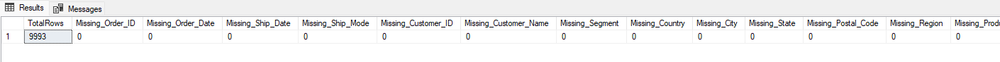
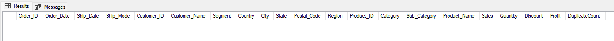
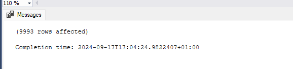
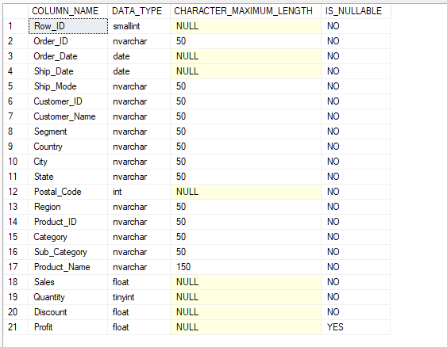
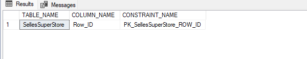
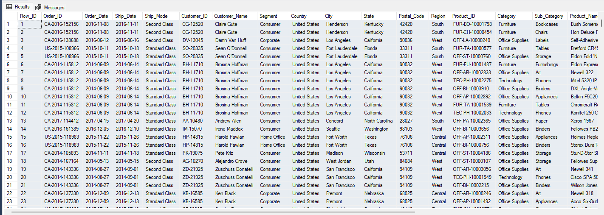

# Sales Performance Dashboard in Power BI


# Overview 
This project is a Sales Performance Dashboard built using Power BI to provide actionable insights into sales trends, top-selling products, and overall sales performance. The dataset was sourced from Kaggle, cleaned and prepared using SQL Server, and visualized in Power BI. Custom measures were created in Power BI for advanced analysis.


# Project Workflow


## Development

What's the general approach in creating this solution from start to finish?

1. Get the data
2. Explore the data in Excel
3. Load the data into SQL Server
4. Clean the data with SQL
5. Test the data with SQL
6. Visualize the data in Power BI
7. Generate the findings based on the insights
8. Write the documentation + commentary
9. Publish the data to GitHub Pages

## Tools 


| Tool | Purpose |
| --- | --- |
| Excel | Exploring the data |
| SQL Server | Cleaning, testing, and analyzing the data |
| Power BI | Visualizing the data via interactive dashboards |
| GitHub | Hosting the project documentation and version control |
| Kaggle | Source of the dataset. | 

# Data Source

The dataset from Kaggle includes sales data such as:

- Date of sales
- Product categories
- Sales revenue
- Profit and loss
 


# Data Understanding  
Initial data exploration was done using Excel. Key steps in this phase included:

- Examining the columns and understanding the nature of the data.
- Identifying missing or inconsistent data.

# Data Cleaning & Preparation (SQL Server)
The data was cleaned and prepared in SQL Server. Below are the SQL scripts used for cleaning, along with sample outputs:


## Data cleaning 
- Identify Missing Values

```sql


SELECT 
    COUNT(*) AS TotalRows,
    SUM(CASE WHEN [Order_ID] IS NULL THEN 1 ELSE 0 END) AS Missing_Order_ID,
    SUM(CASE WHEN [Order_Date] IS NULL THEN 1 ELSE 0 END) AS Missing_Order_Date,
    SUM(CASE WHEN [Ship_Date] IS NULL THEN 1 ELSE 0 END) AS Missing_Ship_Date,
    SUM(CASE WHEN [Ship_Mode] IS NULL THEN 1 ELSE 0 END) AS Missing_Ship_Mode,
    SUM(CASE WHEN [Customer_ID] IS NULL THEN 1 ELSE 0 END) AS Missing_Customer_ID,
    SUM(CASE WHEN [Customer_Name] IS NULL THEN 1 ELSE 0 END) AS Missing_Customer_Name,
    SUM(CASE WHEN [Segment] IS NULL THEN 1 ELSE 0 END) AS Missing_Segment,
    SUM(CASE WHEN [Country] IS NULL THEN 1 ELSE 0 END) AS Missing_Country,
    SUM(CASE WHEN [City] IS NULL THEN 1 ELSE 0 END) AS Missing_City,
    SUM(CASE WHEN [State] IS NULL THEN 1 ELSE 0 END) AS Missing_State,
    SUM(CASE WHEN [Postal_Code] IS NULL THEN 1 ELSE 0 END) AS Missing_Postal_Code,
    SUM(CASE WHEN [Region] IS NULL THEN 1 ELSE 0 END) AS Missing_Region,
    SUM(CASE WHEN [Product_ID] IS NULL THEN 1 ELSE 0 END) AS Missing_Product_ID,
    SUM(CASE WHEN [Category] IS NULL THEN 1 ELSE 0 END) AS Missing_Category,
    SUM(CASE WHEN [Sub_Category] IS NULL THEN 1 ELSE 0 END) AS Missing_Sub_Category,
    SUM(CASE WHEN [Product_Name] IS NULL THEN 1 ELSE 0 END) AS Missing_Product_Name,
    SUM(CASE WHEN [Sales] IS NULL THEN 1 ELSE 0 END) AS Missing_Sales,
    SUM(CASE WHEN [Quantity] IS NULL THEN 1 ELSE 0 END) AS Missing_Quantity,
    SUM(CASE WHEN [Discount] IS NULL THEN 1 ELSE 0 END) AS Missing_Discount,
    SUM(CASE WHEN [Profit] IS NULL THEN 1 ELSE 0 END) AS Missing_Profit
FROM [SalesSuperStore].[dbo].[SalesSuperStore];

```
### Output 


- Check for Entire Row Duplicates
```sql


SELECT 
    [Order_ID], [Order_Date], [Ship_Date], [Ship_Mode], [Customer_ID], 
    [Customer_Name], [Segment], [Country], [City], [State], [Postal_Code], 
    [Region], [Product_ID], [Category], [Sub_Category], [Product_Name], 
    [Sales], [Quantity], [Discount], [Profit],
    COUNT(*) AS DuplicateCount
FROM [SalesSuperStore].[dbo].[SalesSuperStore]
GROUP BY 
    [Order_ID], [Order_Date], [Ship_Date], [Ship_Mode], [Customer_ID], 
    [Customer_Name], [Segment], [Country], [City], [State], [Postal_Code], 
    [Region], [Product_ID], [Category], [Sub_Category], [Product_Name], 
    [Sales], [Quantity], [Discount], [Profit]
HAVING COUNT(*) > 1;

```
### Output 



- Replace Missing Values (Profit is NULL)

```sql

UPDATE [SalesSuperStore].[dbo].[SalesSuperStore]
SET
    [Profit] = ISNULL([Profit], 0); -- Replace missing profit with 0
```
### Output 


- Check Data Types
```sql

SELECT 
    COLUMN_NAME, 
    DATA_TYPE,
    CHARACTER_MAXIMUM_LENGTH,
    IS_NULLABLE
FROM INFORMATION_SCHEMA.COLUMNS
WHERE TABLE_NAME = 'SalesSuperStore'
  AND TABLE_SCHEMA = 'dbo';
```
### Output 


- Check Primary Key
```sql

  SELECT 
    ku.TABLE_NAME,
    ku.COLUMN_NAME,
    tc.CONSTRAINT_NAME
FROM INFORMATION_SCHEMA.TABLE_CONSTRAINTS AS tc
JOIN INFORMATION_SCHEMA.KEY_COLUMN_USAGE AS ku
    ON tc.CONSTRAINT_NAME = ku.CONSTRAINT_NAME
WHERE tc.CONSTRAINT_TYPE = 'PRIMARY KEY'
  AND ku.TABLE_NAME = 'SalesSuperStore'
  AND ku.COLUMN_NAME = 'ROW_ID'
  AND ku.TABLE_SCHEMA = 'dbo';  -- Adjust schema if necessary
```
### Output 


- Verify Uniqueness (ROW_ID)
```sql

SELECT 
    COUNT(*) AS TotalRows,
    COUNT(DISTINCT [ROW_ID]) AS UniqueRowIDs
FROM [SalesSuperStore].[dbo].[SalesSuperStore];
```
### Output 
.png)

- Creating a Primary Key on ROW_ID
```sql

ALTER TABLE [SalesSuperStore].[dbo].[SalesSuperStore]
ADD CONSTRAINT PK_SalesSuperStore_ROW_ID PRIMARY KEY ([ROW_ID]);

```


- Verify Data Consistency
```sql


SELECT  * FROM [SalesSuperStore].[dbo].[SalesSuperStore];


```
### Output 



# Visualization 
### Dashboard Creation in Power BI

The Sales Performance Dashboard includes the following key visuals:

- KPIs such as Total Profit, Total Sales, and Total Quantity Sold.
- Total sales over time with slicers for date and product category.
- Top-selling products and their contribution to total sales.
- map seles by state or region


## Results

- What does the dashboard look like?


This shows the Top UK Youtubers in 2024 so far. 


## DAX Measures

### 1. Total Sales (M)
```sql
Total Sales = SUM(SelesSuperStore[Sales])
 

```

### 2. Total Profit  
```sql
Total Profit = SUM(SelesSuperStore[Profit])

 

```

### 3. Total Quantity Sold
```sql
Total Quantity Sold = SUM(SelesSuperStore[Quantity])

```

### 4. Average Sales per Order
```sql
Average Sales per Order = AVERAGEX(SelesSuperStore, SelesSuperStore[Sales])

```


### 5. Profit Margin
```sql
Profit Margin = DIVIDE([Total Profit], [Total Sales], 0)


```


### 6. Sales Growth
```sql
Sales Growth = 
IF(
    ISBLANK([Total Sales]), 
    BLANK(),
    DIVIDE(
        [Total Sales] - CALCULATE([Total Sales], SAMEPERIODLASTYEAR(SelesSuperStore[Order_Date])),
        CALCULATE([Total Sales], SAMEPERIODLASTYEAR(SelesSuperStore[Order_Date]))
    )
)

```
### 7. Total Discount
```sql
Total Discount = SUM(SelesSuperStore[Discount])
```


# Files Included

- Dashboard  : The main Power BI file for the dashboard.
- SQL Scripts: SQL scripts used for data cleaning and preparation.
- Datasets: Original data from Kaggle, with preliminary analysis.
- README.md: This document.

## Future Improvements

- Adding advanced calculations and KPIs based on user feedback.
- Expanding the dataset to include more regions or product lines.
- Implementing advanced DAX functions for deeper insights.


